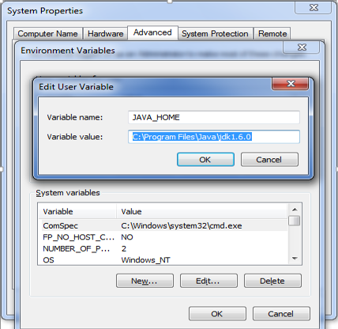

Java TestNG Selenium Tutorial

Prerequisites for TestNG tutorial :

Environment Setup :

This is Windows environment variable location :

Control Panel > All Control Panel Items > System > Advanced system settings > Environment Variables
Step 1) Install JDK and Add ‘JAVA_HOME’ Environment Variable

To install java, click here

 and create a new JAVA_HOME environment variable and set variable value as path value to JDK folder.
 
 
 
 
Step 2) To download Maven click  here and download Binary zip archive file. 
Create new Environment Variables
 ‘MAVEN_HOME’ and ‘M2_HOME’.
and provide variable value as path to maven installation folder.
 

Step 3) Include path to ‘maven/bin’ directory in ‘PATH’ variable present in System variables.

To run maven from command prompt, this is necessary. 

 

Step 4) Verify maven in console
Maven installation is complete. Now lets test it from windows command prompt.
1.	Go to start menu and type cmd in application location search box.
2.	Press ENTER. A new command prompt will be opened.
3.	Type "mvn -version" in command prompt and hit ENTER.

 
This should show the version information of maven installed. If there is any error shown, cross-check all above steps.

LambdaTest Credentials :

•	To use TestNG with LambdaTest, make sure you have the 2 environment variables LT_USERNAME and LT_ACCESS_KEY set. To obtain a username and access_key, sign up for free here).

•	After signing up you can find your username and access key here

Setup :

•	You can download the file. To do this click on “Clone or download” button. You can download zip file.

•	To clone the file, click on “Clone or download” button and copy the link.

•	Then open the command prompt in the folder you want to clone the file. Run the command:

git clone <paste the link here>
 
Test Scenario

In our demonstration, we will be creating a script that uses the Selenium WebDriver to click check boxes and add button. If assert returns true, it indicates that the test case passed successfully and will show up in the automation logs dashboard else if assert returns false, the test case fails, and the errors will be displayed in the automation logs.

•	Single Test- On a single environment (Windows 10) and single browser (Chrome)

You have successfully configured your project and are ready to execute your first TestNG selenium testing script. Here is the configuration file for TestNG selenium Testing. 

Updating Your Config.properties file

Go to “Java-TestNG-Selenium-master\Config.properties” file

Set your LambdaTest_UserName, LambdaTest_AppKey.

Running Tests :

Go to “Java-TestNG-Selenium-master” folder and copy its path.

Open command prompt and run -> cd <path>(that you have copied)
 
Now, use these command

To run single test :

     mvn test -P single
     
To run local test :

Routing traffic through your local machine

•	Set tunnel value to True in test capabilities

OS specific instructions to download and setup tunnel binary can be found at the following links.

•	Windows

•	Mac

•	Linux

Important Note:

________________________________________

•	Some Safari & IE browsers, doesn't support automatic resolution of the URL string "localhost". Therefore if you test on URLs like "http://localhost/" or "http://localhost:8080" etc, you would get an error in these browsers. A possible solution is to use "localhost.lambdatest.com" or replace the string "localhost" with machine IP address. For example if you wanted to test "http://localhost/dashboard" or, and your machine IP is 192.168.2.6 you can instead test on "http://192.168.2.6/dashboard" or "http://localhost.lambdatest.com/dashboard".

To run local test :

    mvn test -P local

To run parallel test :

    mvn test -P parallel

To run single Jenkins test :

    mvn test -P singleJenkins

To run parallel Jenkins test  :

    mvn test -P parallelJenkins

